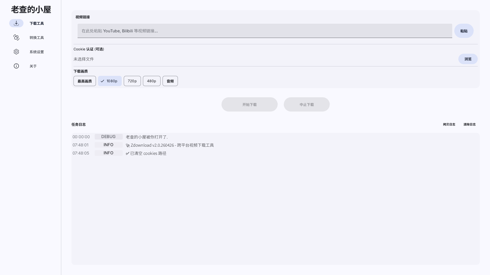
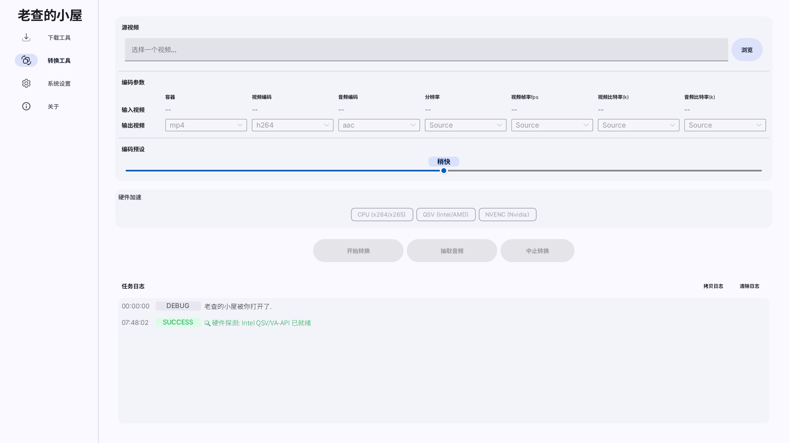

# 老查的小屋

<table style="width: 100%;">
  <tr>
    <td align="center">
      
      <br />
      <sub><b>下载模块</b></sub>
    </td>
    <td align="center">
      
      <br />
      <sub><b>转换模块</b></sub>
    </td>
  </tr>
</table>

## 简介
**老查的小屋** 是一个基于 Rust 和 Slint UI 构建的轻量级、高性能个人工具箱。它专注于系统清洁度与原生体验，为 Linux (Debian) 和 Windows 用户提供高效的日常工具。

## 核心功能
* **🚀 Zdownload**: 基于yt-dlp的GUI下载器,支持图形化导入cookies。
* **🎬 Zconvert**: 简单的视频转码工具，提供直观的界面来处理各种视频格式转换需求。
* **🎨 现代 UI**: 基于 Slint 1.15 构建，Material风格,完美适配 GNOME 环境。

## 系统要求
* **OS**: Debian 13 (推荐) / Windows 10+
* **依赖**: FFmpeg (用于 Zconvert 视频处理),yt-dlp (用于zdownload的视频下载)

## 手动编译
1.  确保已安装 [Rust 编译环境](https://www.rust-lang.org/)。
2.  克隆仓库并进入目录：
    ```bash
    git clone [https://github.com/ArcMantis/zanehouse.git](https://github.com/ArcMantis/zanehouse.git)
    cd zane-house
    ```
3.  运行应用：
    ```bash
    cargo run --release
    ```

---

# License
Copyright © 2026 Zane Zha. Licensed under the [GPL-3.0-only](LICENSE).